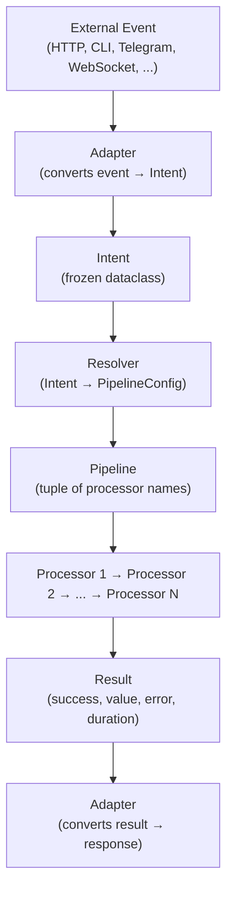
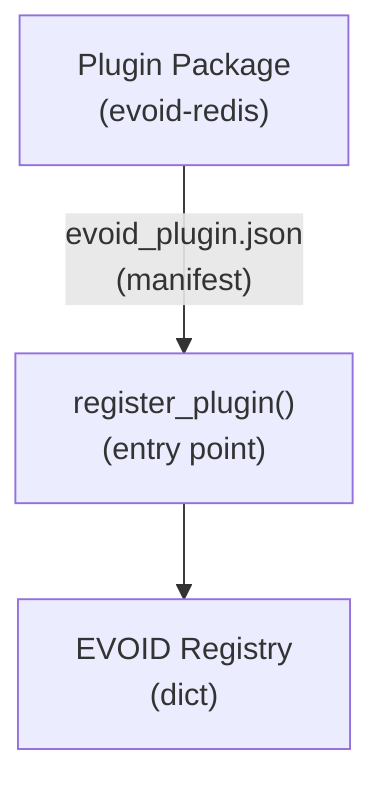

# Architecture

How EVOID works under the hood.

## The Flow

Every request follows this path:



Adapters bridge the outside world to EVOID. Route decorators (`get`, `post`, etc.) live in adapters because each one extracts params differently. See [Adapters](/EVOID/learn/adapters) for details.

## Core Components

### Intent

A frozen dataclass that declares **what** you want to achieve.

```python
from evoid import Intent, Level

intent = Intent(
    name="get_user",
    level=Level.STANDARD,
    metadata={"user_id": 42},
)
```

Intent is **pure data**. It never decides anything. The runtime reads it and decides what to do.

### Pipeline

A tuple of processor names executed in order.

```python
# Default pipelines by level
ephemeral -> ("validate",)
standard  -> ("validate", "authorize")
critical  -> ("validate", "authorize", "audit", "protect")
```

Pipelines are resolved at execution time, not definition time. This means you can change infrastructure without changing business logic.

### Processor

A function that receives a `Context` and returns a result.

```python
async def validate(ctx: Context) -> dict:
    data = ctx.state.get("data")
    if not data:
        raise ValueError("No data")
    ctx.state["validated"] = True
    return {"valid": True}
```

Processors are **independent Lego blocks**. Each one does one thing. The pipeline composes them.

### Context

A mutable databag that flows through the pipeline.

```python
@dataclass
class Context:
    intent: Intent          # What we're doing
    state: dict             # Shared state between processors
    deps: dict              # Injected dependencies
    metadata: dict          # Request metadata
    errors: list            # Accumulated errors
    id: str                 # Unique ID (atomic counter)
```

Context is the **only shared state** between processors. Processors communicate through `ctx.state`.

## Extension Points

### Pipeline Extension

Inject processors without modifying handlers:

```python
from evoid.core.extend import before, after

before("GET:/users/{id}", "rate_limit")
after("GET:/users/{id}", "audit_log")
```

### Plugin Lifecycle Hooks

Observe runtime events:

```python
from evoid import on_event, Event

def log_execution(ctx):
    print(f"Executed: {ctx.intent_name}")

on_event(Event.POST_EXECUTE, log_execution)
```

### Message Bus

Services communicate through Intents, not HTTP. The gateway routes Intent to the correct handler — services stay decoupled:

```python
from evoid import subscribe, publish

# Service A sends Intent — doesn't know who handles it
await publish(Intent(name="process_payment", level=Level.CRITICAL))

# Service B subscribes — doesn't know who sent it
subscribe("process_payment", handle_payment)
```

See [Gateway Pattern](../learn/gateway-pattern.md) for full details on decoupled service architecture.

### Schema Export

Export Intent schemas for AI agents:

```python
from evoid import export_schemas

schemas = export_schemas()
# {"get_user": IntentSchema(name="get_user", ...)}
```

### MCP Server

Expose Intents as tools for AI agents:

```python
from evoid.adapters.mcp import create_mcp_server

server = create_mcp_server("my-api")
# AI agents can discover and invoke Intents
```

## Design Principles

1. **Data carries intent** — Intent is a frozen dataclass, not a class with methods
2. **Pipeline is composition** — Processors are pure functions composed together
3. **No stateful objects** — Registries are dicts, not singleton classes
4. **Extensibility without inheritance** — Use `before/after/replace` to modify pipelines
5. **Zero overhead IOP** — Fast path skips inspection and timeout when not needed
6. **Zero core dependencies** — Everything optional, infrastructure is replaceable via plugins

## Plugin Standard

Plugins follow IOP principles:



- Package name: `evoid-*` or `evoid-plugin-*`
- Manifest: `evoid_plugin.json`
- Entry point: `module:function`
- Installation: `evo install redis` or `uv add evoid-redis`

## Configuration

Two formats supported:

### TOML (evoid.toml)

Each service has its own `evoid.toml`:

```toml
[service]
name = "my-api"

[runtime]
adapter = "asgi"
port = 8000

[engines]
storage = "memory"

[pipeline]
processors = ["validate", "authorize"]
```

### Project Structure (Multi-Service)

EVOID projects use `evo service new` to create proper service structure. Each service gets its own directory with `evoid.toml` + `main.py`:

```
my-project/
├── pyproject.toml           # Project config + [tool.evoid]
├── shared/                  # Shared code (models, utils)
│   └── __init__.py
├── services/
│   ├── gateway/             # Gateway service
│   │   ├── evoid.toml       # ← Service-specific config
│   │   └── main.py          # ← Service code
│   ├── users/
│   │   ├── evoid.toml
│   │   └── main.py
│   └── payments/
│       ├── evoid.toml
│       └── main.py
└── tests/
```

**Why `evo service new`?** Each service needs its own `evoid.toml` because:
1. Services can have different adapters (asgi, telegram, maubot)
2. Services can have different pipelines (validate only vs full audit)
3. Services can have different engines (memory vs sqlite vs redis)
4. Services can run on different ports

```bash
# Create project
evo init my-project
cd my-project

# Add services
evo service new gateway    # Creates services/gateway/{evoid.toml, main.py}
evo service new users      # Creates services/users/{evoid.toml, main.py}
evo service new payments   # Creates services/payments/{evoid.toml, main.py}

# Run
evo run                    # All services
evo service run gateway    # Single service
```

### Serializer Engines

EVOID supports multiple serializers. Choose based on your needs:

| Engine | Install | Size | Speed | Use Case |
|--------|---------|------|-------|----------|
| `json` | built-in | 1x | 1x | Default, always works |
| `msgpack` | `evo install msgpack` | 0.2-0.5x | 2-5x | High-performance APIs |
| `msgspec` | `pip install msgspec` | 1x | 3-10x | Fastest JSON |
| `pydantic` | `evo install pydantic` | 1x | 0.5x | Schema validation |

```toml
# In evoid.toml
[engines]
serializer = "msgpack"  # Use msgpack for this service
```

```python
# Or set programmatically
from evoid.engines.serializer import set_serializer
from evoid.engines.serializer.msgpack_engine import MsgpackSerializer

set_serializer(MsgpackSerializer())
```

### Python Config

```python
from evoid.config import config

app = config(
    service={"name": "my-api"},
    engines={"storage": "memory", "serializer": "msgpack"},
)
```

## Related

- [Intent](../learn/intent.md) — Deep dive into Intents
- [Pipeline](../learn/pipeline.md) — How execution works
- [Processors](../learn/processors.md) — Functions that handle intents
- [Schema Export](../learn/schema-export.md) — Export Intent schemas
- [Plugin Hooks](../learn/plugin-hooks.md) — Lifecycle events
- [Plugin Standard](../learn/plugin-standard.md) — Plugin packaging
- [Python Config](../learn/python-config.md) — Python-native config
