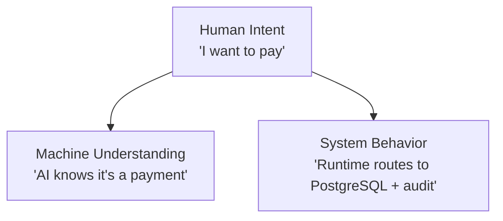

# IOP Philosophy

IOP isn't just a technical pattern. It's a response to a fundamental shift in how software is built, consumed, and understood.

## The Abstraction Crisis

For decades, software abstraction followed a predictable path:

```
Machine Code → Assembly → C → OOP → Frameworks → Microservices
```

Each layer hid complexity from the layer below. But by 2023, something broke.

### The Problem

Modern applications aren't just code — they're **systems of systems**:

- A single API call touches: load balancer → auth → rate limiter → cache → database → queue → logger
- A single user action triggers: validation → business logic → side effects → notifications → analytics
- A single deployment requires: config → secrets → feature flags → A/B tests → monitoring

The abstractions we built (OOP, MVC, microservices) were designed for **code organization**, not **system coordination**. They tell you *where* code lives, not *what* it needs to happen.

### The Coordination Tax

Every function in a traditional system must know:

1. **Which infrastructure** to use (database, cache, queue)
2. **Which security layer** to apply (auth, audit, rate limit)
3. **Which data format** to expect (JSON, protobuf, binary)
4. **Which failure mode** to handle (timeout, retry, fallback)

This is the **coordination tax** — the overhead of making independent systems work together. It grows with every service you add, every team that joins, and every integration you build.

## Enter AI: The Catalyst

AI agents didn't create the abstraction crisis. They **exposed** it.

### The AI Agent Problem

AI agents need to interact with software. But traditional software isn't designed for machines to understand:

```python
# Traditional code — humans understand, machines don't
async def get_user(user_id: int):
    user = await db.get_user(user_id)
    if not user:
        raise HTTPException(404)
    cached = cache.get(f"user:{user_id}")
    if cached:
        return cached
    # ... 20 more lines of infrastructure
```

An AI agent looking at this code sees:
- A function name (`get_user`) — vague
- A database call — which database?
- A cache call — which cache?
- An exception — what does 404 mean in this context?
- 20 more lines — what does any of this do?

**The AI can't understand the intent.** It sees the *how*, not the *what*.

### What AI Agents Need

AI agents need a **contract** — a machine-readable description of:

- **What** this operation does (name + description)
- **What** it needs (metadata fields)
- **What** level of protection it requires (ephemeral/standard/critical)
- **What** happens in the pipeline (validate → authorize → audit)

This is exactly what IOP provides.

## The Industry Response

Microsoft, Google, and others recognized this problem. Their solutions converged on the same idea: **make intent explicit**.

### Microsoft: Semantic Kernel

Microsoft's Semantic Kernel (2023) introduced "plugins" that AI agents could discover and invoke:

```csharp
// Microsoft's approach: function descriptions for AI
[KernelFunction]
[Description("Gets a user by their unique ID")]
public async Task<User> GetUser(int userId) { ... }
```

The idea: annotate functions with descriptions so AI agents can understand and call them. But the infrastructure decisions (which database, which cache, which auth) are still in the function body.

### Google: Gemini Function Calling

Google's Gemini (2024) added function calling — AI agents can invoke functions defined as JSON schemas:

```json
{
  "name": "get_user",
  "description": "Get a user by ID",
  "parameters": {
    "user_id": {"type": "integer"}
  }
}
```

Same idea: describe functions so AI can call them. But the *infrastructure* is still implicit.

### OpenAI: Function Calling + MCP

OpenAI's function calling (2023) and the Model Context Protocol (2025) went further:

```python
# MCP: expose tools to AI agents
tools = [
    {
        "name": "get_user",
        "description": "Get a user by ID",
        "parameters": {"user_id": {"type": "integer"}}
    }
]
```

MCP standardized how AI agents discover and invoke tools. But it still doesn't address *infrastructure* — the tool does whatever it does internally.

### The Common Thread

All these solutions share one insight: **AI needs to understand intent**. But they stop at the API boundary — they describe *what* a function does, not *how* the system should handle it.

IOP goes further. It says: the intent isn't just for the AI agent — it's for the **entire system**.

## IOP: The Full Picture

IOP unifies three things that were previously separate:

### 1. Human Intent (What You Want)

```python
PROCESS_PAYMENT = Intent(
    name="process_payment",
    level=Level.CRITICAL,
    metadata={"amount": 99.99, "currency": "USD"},
)
```

You declare: "I want to process a payment." The runtime decides: which database, which auth, which audit, which protection.

### 2. Machine Understanding (What AI Sees)

```python
# AI agent discovers this via schema export
{
    "name": "process_payment",
    "description": "Process a payment transaction",
    "level": "critical",
    "pipeline": ["validate", "authorize", "audit", "protect"],
    "metadata": {"amount": {"type": "float"}, "currency": {"type": "string"}}
}
```

The AI agent knows: this is a payment, it needs full protection, it requires authorization.

### 3. System Behavior (What Happens)

```python
# Pipeline: validate → authorize → audit → protect → handler
# Infrastructure: PostgreSQL (critical level), email notifications, full audit log
# The runtime chooses based on the level
```

The system knows: this is critical, route to PostgreSQL, enable audit logging, enforce rate limits.

### The Triangle



**IOP is the only paradigm that connects all three.** Traditional approaches handle one or two:
- OOP: Human intent + system behavior (but no machine understanding)
- API schemas: Human intent + machine understanding (but no system behavior)
- Config-driven: System behavior (but no human intent or machine understanding)

## Why Now?

Three forces converged to make IOP necessary:

### 1. AI Agents Became Real

Before 2023, AI was a chatbot. After 2023, AI agents could:
- Browse the web
- Write code
- Call APIs
- Make decisions

But they needed **structured contracts** to interact with software safely. IOP provides those contracts.

### 2. Infrastructure Became Invisible

Cloud services, serverless, and managed databases made infrastructure *easy to add* but *hard to coordinate*. The problem shifted from "how do I set up a database?" to "which database should this request use?"

IOP answers: the Intent level decides.

### 3. Systems Became Distributed

Microservices, event-driven architectures, and multi-region deployments meant that a single user action could touch dozens of services. Coordinating them manually was impossible.

IOP answers: Intents flow through the system, and the pipeline composes the coordination.

## The IOP Mindset

Using IOP requires a mental shift:

### Old Thinking: "How do I do this?"

```python
# "I need to save a user. Which database? How do I cache it?
#  Should I audit this? What if it fails?"
async def save_user(user):
    db.insert("users", user)        # I chose this
    cache.set(f"user:{user.id}", user)  # I chose this
    audit_log("user_created", user)     # I chose this
```

### New Thinking: "What do I want to happen?"

```python
# "I want to save a user. The runtime decides the rest."
SAVE_USER = Intent(
    name="save_user",
    level=Level.STANDARD,
    # Runtime: validate → authorize → handler
    # Infrastructure: chosen by level, configurable via plugins
)
```

The shift: from **imperative** (how) to **declarative** (what).

### What Changes

| Before | After |
|--------|-------|
| "Use PostgreSQL" | "Store this data" |
| "Check JWT token" | "Authorize this action" |
| "Log to file" | "Audit this operation" |
| "Retry 3 times" | "This is critical" |
| "Cache for 5 minutes" | "This is ephemeral" |

### What Stays the Same

- Your business logic stays the same
- Your data models stay the same
- Your testing stays the same
- Your team structure stays the same

IOP doesn't replace your code. It **moves infrastructure decisions** from your code to the pipeline.

## The Future

IOP is designed for a world where:

- **AI agents** are first-class citizens that need to understand and invoke your system
- **Infrastructure** is dynamic and changes based on context (load, compliance, cost)
- **Systems** are distributed and need coordination without manual wiring
- **Security** is enforced by the system, not by each developer remembering to add it

The Intent is the contract. The pipeline is the enforcer. The runtime is the coordinator.

> "In the future, every function will have a description. Every call will have a level. Every system will have a pipeline. IOP is how we get there."

## Related

- [What is IOP?](what-is-iop.md) — Technical introduction
- [IOP Levels](../learn/iop-levels.md) — The three levels
- [Why EVOID?](why-evoid.md) — The origin story
- [Schema Export](../learn/schema-export.md) — AI agent integration
