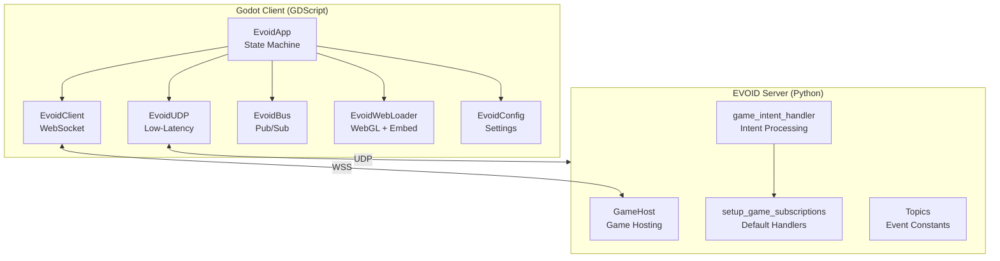
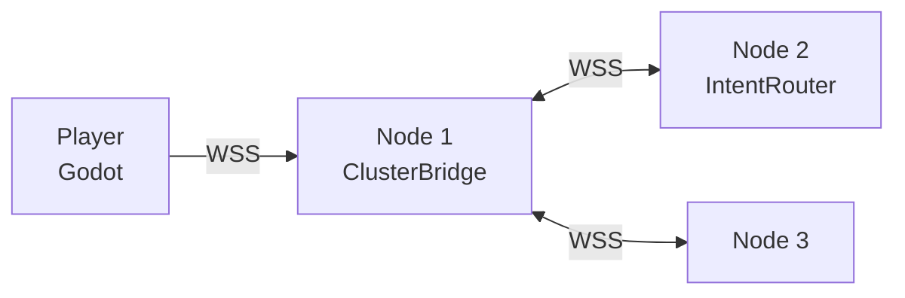

# Godot + EVOID Game Integration

Build real multiplayer games with Godot (client) and EVOID (server). One plugin, every scenario — desktop, web, embed, UDP.

!!! info "Who is this for?"
    - Game developers who want multiplayer without writing server code from scratch
    - Web developers who want to embed games in their sites seamlessly
    - Anyone who wants to see IOP in action beyond REST APIs

## Architecture



### The Two Plugins

| Plugin | Runs Where | What It Does |
|--------|-----------|--------------|
| **evoid_godot** (GDScript) | Godot client | WebSocket/UDP connection, state machine, event bus, web loading, embed API |
| **evoid-godot** (Python) | EVOID server | Intent handling, message bus, game hosting, embed mode |

## Components

| Component | Purpose |
|-----------|---------|
| `EvoidApp` | State machine + orchestration layer (BOOT → IDLE → CONNECTING → ONLINE → RECOVERING → ERROR) |
| `EvoidClient` | WebSocket connection (JSON + binary frames) |
| `EvoidUDP` | Low-latency UDP transport (18-byte binary header, 3 channels) |
| `EvoidBus` | Pub/sub event bus (zero-coupling, O(1) lookup) |
| `EvoidConfig` | Configuration resource (Inspector-friendly, UDP, embed, export fields) |
| `EvoidTopics` | Topic constants (mirrors Python server) |
| `EvoidWebLoader` | WebGL auto-detection + manifest-aware prefetch + embed postMessage API |
| `EvoidExportPlugin` | Export-time optimizations (SW injection, manifest generation) |

## Setup Scenarios

### Scenario 1: Desktop Game

```gdscript
func _ready():
    var config = EvoidConfig.new()
    config.server_url = "wss://your-server.com"
    config.game_id = "my-game"
    EvoidApp.config = config
    EvoidApp.connect_to_server()
```

**Prerequisites:** Godot 4.4+, EVOID server (Python 3.12+)

### Scenario 2: Web Game (Standalone)

```gdscript
func _ready():
    var config = EvoidConfig.new()
    config.game_id = "my-game"
    EvoidApp.config = config
    EvoidApp.auto_connect()  # auto-detects WebGL, resolves same-origin URL
```

**Prerequisites:** Godot 4.4+ with HTML5 export template, EVOID server with GameHost

### Scenario 3: Embed in Website (Seamless)

```html
<!-- Parent website -->
<iframe src="/game/tic-tac-toe/" width="400" height="600" frameborder="0"></iframe>
<script>
iframe.addEventListener("message", (e) => {
    if (e.data.type === "evoid:player_joined") {
        showPlayerCount(e.data.player_id);
    }
});
// Send intent to game
iframe.contentWindow.postMessage({type: "evoid:send_intent", name: "pause", metadata: {}}, "*");
</script>
```

```gdscript
# Game side — receive from parent
func _ready():
    EvoidWebLoader.embed_message.connect(_on_embed_message)

func _on_embed_message(message: Dictionary):
    match message.get("type"):
        "evoid:focus": grab_focus()
        "evoid:resize": resize_canvas(message.get("width"), message.get("height"))
```

**Prerequisites:** Server with `GameHost(embed_mode=True)`, parent page supports postMessage

### Scenario 4: UDP Transport (Low-Latency)

```gdscript
func _ready():
    var config = EvoidConfig.new()
    config.udp_address = "your-server.com"
    config.udp_port = 9000
    EvoidApp.config = config
    EvoidApp.connect_udp(config.udp_address, config.udp_port, "Player1")
```

~0.5ms overhead vs ~2-5ms for WebSocket. 3 channels: reliable (game actions), unreliable (positions), chat.

**Prerequisites:** evoid-transport plugin on server, UDP port open

### Scenario 5: Binary Intents (Bandwidth Optimization)

```gdscript
# ~60% smaller than JSON
EvoidClient.send_intent_binary("player_move", {"x": 10, "y": 20})
```

### Scenario 6: Auto-Reconnect

Built-in. If connection drops:
- State: ONLINE → RECOVERING
- Exponential backoff: 1s, 2s, 4s, 8s, 16s, 20s (cap)
- Auto-retry up to `max_reconnect_attempts`

## Project Structure

```
your-game/
├── addons/
│   └── evoid_godot/           # Godot plugin (client)
│       ├── core/
│       │   ├── app.gd         # State machine + orchestration
│       │   ├── client.gd      # WebSocket connection
│       │   ├── udp_client.gd  # UDP transport
│       │   ├── event_bus.gd   # Pub/sub messaging
│       │   ├── config.gd      # Configuration
│       │   ├── topics.gd      # Topic constants
│       │   └── web_loader.gd  # WebGL + embed API
│       ├── export_plugin.gd   # Export optimizations
│       ├── plugin.cfg
│       └── plugin.gd
├── scenes/
│   ├── main.tscn              # Main game scene
│   ├── player.tscn            # Player prefab
│   └── lobby.tscn             # Matchmaking lobby
└── scripts/
    ├── main.gd                # Game controller
    ├── player.gd              # Player logic
    └── network.gd             # EVOID integration
```

## How It Works

### Client (Godot)

```gdscript
# 1. Connect — auto-detects WebGL
func _ready():
    EvoidApp.auto_connect()

# 2. Send player actions
func _on_shot_pressed():
    EvoidApp.send_intent("player_shot", {
        "origin": global_position,
        "direction": aim_direction,
    })

# 3. Receive server events
func _ready():
    EvoidBus.subscribe(EvoidTopics.GAME_EVENT, _on_game_event)

func _on_game_event(payload: Dictionary):
    match payload.get("type"):
        "player_moved": update_player(payload)
        "shot_fired": show_bullet(payload)
```

### Server (EVOID)

```python
# 1. Setup game
from evoid_godot import setup_game_subscriptions, setup_game_hosting
setup_game_subscriptions("my-game")

# 2. Serve the game (with embed mode)
from evoid_godot import GameHost, SplashConfig

host = GameHost(embed_mode=True)  # seamless iframe embed
host.register_build("my-game", "builds/my-game/", title="My Game")

# 3. Handle game intents
from evoid import subscribe

async def on_shot(intent):
    player_id = intent.metadata["player_id"]
    await publish(Intent(
        name="game_event",
        metadata={"type": "shot_fired", "player_id": player_id}
    ))

subscribe("game:my-game:player_shot", on_shot)
```

## How Hosting Works (No Download)

The game doesn't download — it **streams** from the server. Here's what happens:

```
User clicks link: /game/my-game/
    ↓
1. HTML splash loads instantly (<100ms)
   └─ Just a div with progress bar, no game code yet
    ↓
2. Service Worker registers
   └─ Caches everything for instant repeat visits
    ↓
3. engine.wasm streams in background (~5-10MB)
   └─ Godot engine as WebAssembly, loads once, cached forever
    ↓
4. game.pck loads in chunks (256KB each)
   └─ Server splits the game data into small pieces
   └─ Client loads chunk 0, 1, 2, ... with progress bar
    ↓
5. Game starts — splash fades
   └─ All data is in memory, game runs natively in browser
    ↓
6. WebSocket connects to /ws
   └─ Player joins game, real-time multiplayer begins
```

### What GameHost Does

`GameHost` is a Python class that turns your Godot HTML5 export into a web-served game:

```python
from evoid_godot import GameHost

host = GameHost()
host.register_build("my-game", "builds/my-game/", title="My Game")

# This creates routes for everything:
# /game/my-game/           → HTML page with splash
# /game/my-game/manifest.json → file list + chunk count
# /game/my-game/sw.js       → Service Worker
# /game/my-game/engine.wasm → Godot engine
# /game/my-game/chunk/0     → First 256KB of game.pck
# /game/my-game/chunk/1     → Next 256KB of game.pck
# ...etc
```

### Why It Feels Instant

| Mechanism | What It Does |
|-----------|-------------|
| **HTML splash** | Shows progress bar in <100ms, user sees something immediately |
| **Service Worker** | Caches engine.wasm + game.pck — second visit loads from cache (0ms) |
| **Chunked PCK** | Game data loads in 256KB pieces with progress — not one giant download |
| **Manifest** | Tells client exactly how many chunks to expect — no guessing |

### First Visit vs Repeat Visit

```
FIRST VISIT:
  HTML (100ms) → engine.wasm (5s) → game.pck chunks (3s) → Game starts
  Total: ~8-10 seconds

REPEAT VISIT (SW cached):
  HTML (100ms) → engine.wasm (0ms, cached) → game.pck (0ms, cached) → Game starts
  Total: <1 second
```

### Client-Side Loading (EvoidWebLoader)

The Godot plugin handles loading automatically:

```gdscript
# EvoidWebLoader — registered as autoload
# 1. Fetches manifest.json to know chunk count
# 2. Prefetches chunks in background
# 3. Listens for postMessage from parent (embed mode)

func _ready():
    EvoidWebLoader.manifest_loaded.connect(_on_manifest)
    EvoidWebLoader.prefetch_chunks()  # starts loading
```

### Server-Side Hosting (GameHost)

```python
# Standalone — full splash screen
host = GameHost()
host.register_build("my-game", "builds/my-game/", title="My Game",
    splash=SplashConfig(bg_color="#1a1a2e", accent_color="#e94560"))

# Embed — minimal loader, transparent background
host_embed = GameHost(embed_mode=True)
host_embed.register_build("my-game", "builds/my-game/")

# Mount both
app = Starlette(routes=[
    Mount("/game", app=host.create_router()),      # standalone
    Mount("/embed", app=host_embed.create_router()), # iframe
])
```

## Export Optimizations

The plugin automatically optimizes web exports:

- **Service Worker injection** — `EvoidExportPlugin` injects SW registration into `index.html`
- **Manifest generation** — auto-generates `manifest.json` for chunk-aware loading
- **Binary intents** — `send_intent_binary()` uses WebSocket binary frames (~60% smaller)
- **Manifest-aware prefetch** — `EvoidWebLoader.prefetch_chunks()` uses server manifest for correct chunk count

```gdscript
# Config for export optimizations
var config = EvoidConfig.new()
config.optimize_web = true        # SW injection, manifest gen
config.binary_intents = false     # binary WebSocket frames
config.pck_compression = "fast"   # none/fast/zip
```

## Cluster Compatibility

EVOID cluster is **transparent** to the Godot client. The game connects to one node via `EvoidApp.connect_to_server()`. The server-side cluster plugin handles routing between nodes.



The client doesn't know or care how many nodes exist. `connect_to_server()` works with any node.

**Prerequisites (server-side only):**
- evoid-cluster plugin installed
- WebSocket ports open between nodes
- evoid-di for service discovery

## DI Pattern

This plugin uses **Godot's native autoload singleton pattern** — the equivalent of DI in GDScript. All components (`EvoidApp`, `EvoidClient`, `EvoidUDP`, `EvoidBus`, `EvoidWebLoader`) are globally accessible singletons.

On the server side, the Python `evoid-godot` plugin registers with `evoid-di`:

```python
di.register("godot", create_game_handler, scope="singleton")
```

If you need testable code, `EvoidConfig` is the only injectable component — pass it to `EvoidApp.config`.

## Quick Setup

```bash
# 1. Install EVOID server plugins
uv add evoid evoid-godot

# 2. Clone the Godot plugin
git clone https://github.com/EvolveBeyond/evoid-godot.git

# 3. Copy to your Godot project
cp -r evoid-godot/evoid_godot your-game/addons/

# 4. Enable in Godot
# Project → Project Settings → Plugins → EVOID → Enable
```

## What You'll Build

### Project 1: Arena Shooter

A Counter-Strike-style top-down shooter. Two players, real-time movement and shooting.

```
Player 1 (Godot) ←→ EVOID Server ←→ Player 2 (Godot)
```

**What you learn:**
- WebSocket real-time communication
- Player movement sync
- Shot detection and broadcasting
- Game state management
- Hosting Godot WebGL on EVOID

### Project 2: Online Tic-Tac-Toe

A browser-based tic-tac-toe. One player in Godot, one in browser (or both in Godot).

```
Player 1 (Godot/WebGL) ←→ EVOID Server ←→ Player 2 (Godot/WebGL)
```

**What you learn:**
- Turn-based game logic
- Server-side validation (no cheating)
- Room/matchmaking system
- Instant game loading (no download)
- Embedding games in websites

## Next

Start with the [Arena Shooter](shooter-overview.md) — it covers real-time movement and shooting.

Or skip to [Tic-Tac-Toe](tictactoe-overview.md) — it covers turn-based logic and instant loading.
