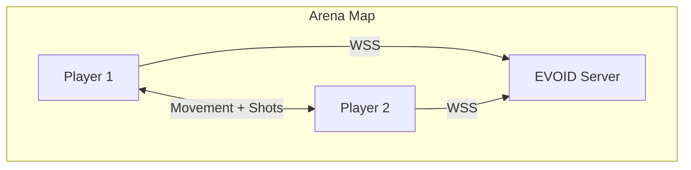

# Arena Shooter

Build a top-down multiplayer shooter. Two players, real-time movement, shooting, and hit detection.

## What We're Building



**Features:**
- Real-time player movement (60fps sync)
- Shot detection with raycasting
- Health system
- Score tracking
- Desktop + WebGL export
- Binary intents (bandwidth optimization)

## Project Structure

```
arena-shooter/
├── addons/evoid_godot/          # Godot plugin
├── scenes/
│   ├── main.tscn                # Game scene
│   ├── player.tscn              # Player prefab
│   ├── bullet.tscn              # Bullet prefab
│   └── hud.tscn                 # Health/score UI
├── scripts/
│   ├── main.gd                  # Game controller
│   ├── player.gd                # Player movement + shooting
│   ├── bullet.gd                # Bullet physics
│   └── hud.gd                   # UI updates
└── server/
    ├── main.py                  # EVOID server entry
    ├── game.py                  # Game logic
    └── requirements.txt
```

## How It Works

### Movement Flow

```
Player presses W/A/S/D
    ↓
Godot: EvoidApp.send_intent("player_move", {x, y})
    ↓ (WebSocket)
EVOID Server: validates position, broadcasts to all
    ↓ (WebSocket)
Other Godot clients: update remote player position
```

### Shot Flow

```
Player clicks mouse
    ↓
Godot: EvoidApp.send_intent("player_shot", {origin, direction})
    ↓ (WebSocket)
EVOID Server: validates shot, checks hit, calculates damage
    ↓ (WebSocket)
All clients: show bullet animation, update health
```

## Tutorials

1. **[Server Setup](shooter-server.md)** — EVOID server with game logic
2. **[Client Setup](shooter-client.md)** — Godot scene and player controller
3. **[Multiplayer](shooter-multiplayer.md)** — Connect two players
4. **[Web Export](shooter-web.md)** — Deploy as WebGL

## Next

Start with [Server Setup](shooter-server.md).
