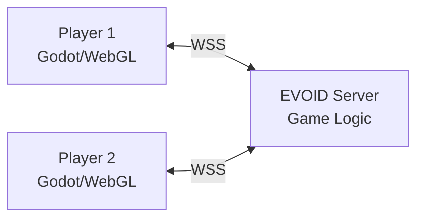

# Online Tic-Tac-Toe

Build a browser-based tic-tac-toe. Two players, turn-based, server-validated (no cheating).

## What We're Building



**Features:**
- Turn-based gameplay
- Server-side validation (impossible to cheat)
- Room system (private games)
- Win/draw detection
- Desktop + WebGL export
- Embeddable in any website (postMessage API)

## Why Tic-Tac-Toe?

Simple game, powerful concepts:
- **Turn management** — who goes when
- **Server validation** — server decides valid moves
- **State sync** — both players see the same board
- **Win detection** — server checks for winners

These patterns scale to chess, checkers, card games, and more.

## Project Structure

```
tic-tac-toe/
├── addons/evoid_godot/          # Godot plugin
├── scenes/
│   ├── main.tscn                # Game board
│   ├── lobby.tscn               # Room selection
│   └── cell.tscn                # Board cell
├── scripts/
│   ├── main.gd                  # Game controller
│   ├── board.gd                 # 3x3 board logic
│   ├── cell.gd                  # Cell click handling
│   ├── lobby.gd                 # Room UI
│   └── network.gd               # EVOID integration
└── server/
    ├── main.py                  # EVOID server
    ├── game.py                  # Tic-tac-toe logic
    └── requirements.txt
```

## Tutorials

1. **[Server Logic](tictactoe-server.md)** — Game rules, turn management, win detection
2. **[Client Setup](tictactoe-client.md)** — Godot board, cell clicks, rendering
3. **[Multiplayer](tictactoe-multiplayer.md)** — Room system, matchmaking
4. **[Web Deploy](tictactoe-web.md)** — Instant loading in browser

## Next

Start with [Server Logic](tictactoe-server.md).
