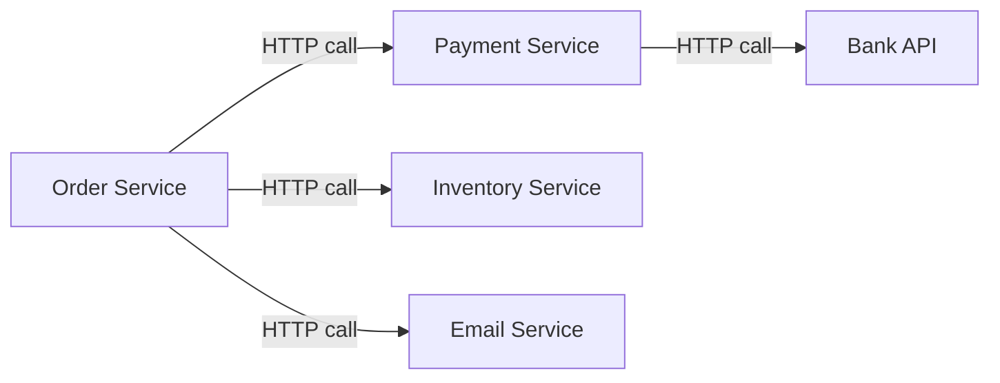
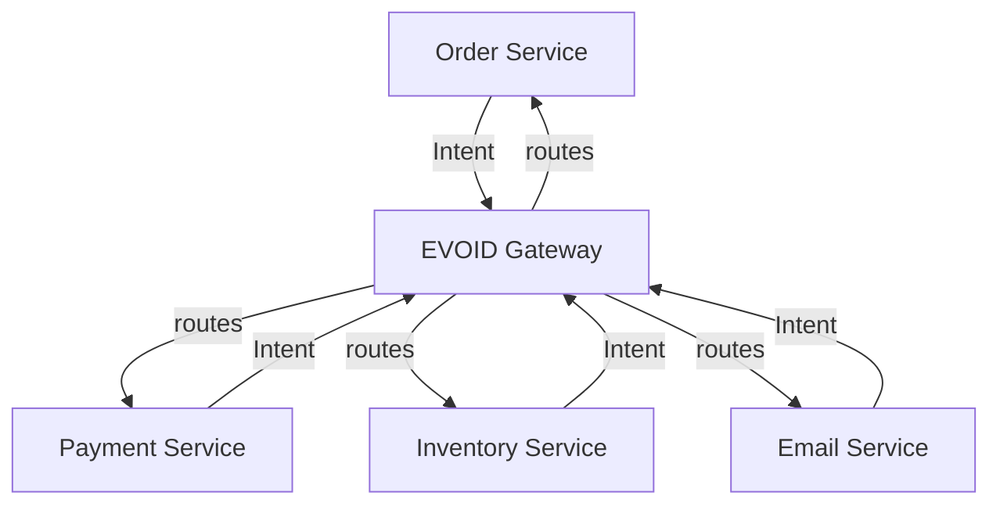
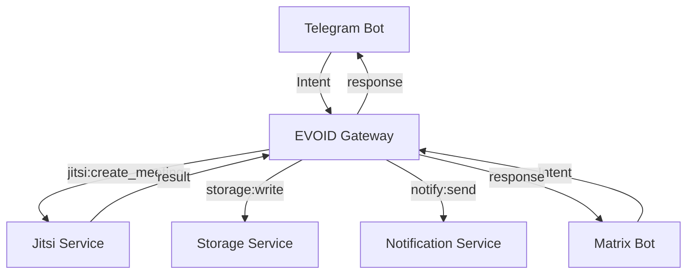

# Gateway Pattern

In EVOID, services don't call each other directly. They send Intents to a **gateway**, and the gateway decides how to route, secure, and execute them.

## The Problem: Tight Coupling

Traditional microservices talk directly to each other:



Every service must know:
- Which other services exist
- How to call them (URLs, protocols, auth)
- What data format they expect
- How to handle failures

This creates a **dependency web** — adding a new service means updating every service that talks to it.

## The Solution: Intent Gateway

With EVOID, services only know the **gateway**:



Services send Intents. The gateway routes them. No service knows about any other service.

## How It Works

### 1. Service Sends Intent

```python
from evoid import Intent, Level, publish

# Order service wants to process a payment
# It doesn't know WHERE payment lives or HOW it's executed
intent = Intent(
    name="process_payment",
    level=Level.CRITICAL,
    metadata={
        "amount": 99.99,
        "currency": "USD",
        "order_id": "ORD-123",
    },
)

# Fire and forget — gateway handles routing
result = await publish(intent, source="order_service")
```

### 2. Gateway Routes Intent

The gateway (EVOID runtime) resolves the Intent:

```
Intent "process_payment" (level=CRITICAL)
    ↓
Pipeline: validate → authorize → audit → protect
    ↓
Handler: payment_service.process_payment()
    ↓
Result returned to caller
```

### 3. Service Receives Result

```python
if result:
    payment_id = result[0].get("payment_id")
    # Continue with order processing
```

The order service never knew:
- Where the payment service runs
- What database it uses
- What auth it requires
- How to handle its failures

## Security by Design

The gateway enforces security **automatically** based on Intent level:

### Level-Based Protection

```python
# EPHEMERAL — minimal security
Intent(name="cache_hit", level=Level.EPHEMERAL)
# Pipeline: validate only

# STANDARD — balanced security
Intent(name="get_user", level=Level.STANDARD)
# Pipeline: validate → authorize

# CRITICAL — full security
Intent(name="process_payment", level=Level.CRITICAL)
# Pipeline: validate → authorize → audit → protect
```

### What Each Processor Does

| Processor | Security Function | CRITICAL Level |
|-----------|-------------------|----------------|
| `validate` | Input sanitization, schema checks | Yes |
| `authorize` | Permission verification, auth tokens | Yes |
| `audit` | Action logging, compliance trail | Yes |
| `protect` | Rate limiting, circuit breaking, encryption | Yes |

### Custom Security Processors

Add your own security layers:

```python
from evoid.core import register_processor

async def check_fraud(ctx):
    """Block suspicious transactions."""
    amount = ctx.intent.metadata.get("amount", 0)
    if amount > 10000:
        return {"authorized": False, "reason": "Amount exceeds limit"}
    return {"authorized": True}

async def enforce_mfa(ctx):
    """Require MFA for critical operations."""
    mfa_token = ctx.intent.metadata.get("mfa_token")
    if not mfa_token:
        return {"authorized": False, "reason": "MFA required"}
    return {"authorized": True}

register_processor("check_fraud", check_fraud)
register_processor("enforce_mfa", enforce_mfa)

# Inject into pipeline
from evoid.core.extend import before_processor
before_processor("process_payment", "authorize", "check_fraud")
after_processor("process_payment", "authorize", "enforce_mfa")
```

## Multi-Service Orchestration

### Parallel Execution

Run multiple Intents concurrently:

```python
from evoid import parallel, Intent, Level

# Fire 3 intents in parallel
intents = [
    Intent(name="check_inventory", metadata={"item_id": "SKU-123"}),
    Intent(name="calculate_shipping", metadata={"address": "..."}),
    Intent(name="apply_discount", metadata={"code": "SAVE20"}),
]

results = await parallel(intents)
# All 3 run concurrently through the gateway
```

### Sequential Pipeline

Chain Intents in order:

```python
from evoid.core.pipeline import execute
from evoid import Intent, Level

# Order processing pipeline
steps = [
    Intent(name="validate_order", level=Level.STANDARD),
    Intent(name="process_payment", level=Level.CRITICAL),
    Intent(name="update_inventory", level=Level.STANDARD),
    Intent(name="send_confirmation", level=Level.EPHEMERAL),
]

for intent in steps:
    result = await execute(intent)
    if not result.success:
        # Pipeline auto-halts on failure
        break
```

### Message Bus

Subscribe to Intents across services:

```python
from evoid import subscribe, publish, Intent

# Email service subscribes to order events
async def send_order_email(intent):
    order_id = intent.metadata.get("order_id")
    # Send confirmation email
    return {"status": "sent"}

subscribe("order_created", send_order_email)

# Any service can trigger it
await publish(Intent(
    name="order_created",
    metadata={"order_id": "ORD-123", "user_email": "..."}
))
```

## Service Discovery

Services don't register with each other. They register with the gateway:

```python
from evoid.native import create_service, on
from evoid import Intent, Level

# Payment service registers its capabilities
app = create_service("payment")
PAYMENT = Intent(name="process_payment", level=Level.CRITICAL)

async def handle_payment(intent: Intent) -> dict:
    return {"payment_id": "PAY-456"}

on(app, PAYMENT, handle_payment)

# Order service sends Intent — gateway finds payment handler
await publish(PAYMENT, metadata={"amount": 99.99})
```

The gateway maintains a registry of:
- Intent names → handlers
- Intent levels → pipelines
- Service health → routing decisions

## Real-World Example: Jitsi Bot



Both bots share the same gateway. Both use the same Intents. Neither knows about the other.

```python
# Telegram bot
from evoid.adapters.telegram import create_bot, on, run_bot

bot = create_bot(token)
on(bot, "command:/create", lambda i: publish(
    Intent(name="jitsi:create_meeting", metadata=i.metadata)
))

# Matrix bot (maubot plugin)
# Same Intent, different adapter
intent = Intent(name="jitsi:create_meeting", metadata={...})
await publish(intent)
```

## Project Structure

Each service has its own `evoid.toml` + `main.py`:

```
my-project/
├── pyproject.toml           # Project config + [tool.evoid]
├── shared/                  # Shared code
├── services/
│   ├── gateway/
│   │   ├── evoid.toml       # port=8000, adapter=asgi, pipeline=[validate,authorize,audit,protect]
│   │   └── main.py
│   ├── telebot/
│   │   ├── evoid.toml       # port=8001, adapter=telegram, pipeline=[validate,authorize]
│   │   └── main.py
│   └── jitsi/
│       ├── evoid.toml       # port=8003, adapter=asgi, storage=sqlite
│       └── main.py
└── tests/
```

**Why separate `evoid.toml` per service?**

Each service can have:
- Different adapter (asgi, telegram, maubot)
- Different pipeline (validate only vs full audit)
- Different engines (memory vs sqlite vs redis)
- Different port

```bash
evo init my-project
evo service new gateway     # Creates services/gateway/{evoid.toml, main.py}
evo service new telebot     # Creates services/telebot/{evoid.toml, main.py}
evo service new jitsi       # Creates services/jitsi/{evoid.toml, main.py}
evo run                     # Run all services
```

## Benefits

| Traditional | EVOID Gateway |
|-------------|---------------|
| Service A knows Service B's URL | Service A knows only Intent name |
| Auth tokens passed manually | Auth enforced by pipeline |
| Each service implements rate limiting | Rate limiting in gateway |
| Logging scattered across services | Audit trail in gateway |
| Failure handling per-service | Circuit breaker in gateway |
| Adding Service C requires updating A, B, D | Adding Service C: register Intent handler |

## Gotchas

- Intents are **data**, not commands. The gateway decides execution.
- The `source` field in `publish()` tracks which service sent the Intent — use it for auditing.
- CRITICAL Intents run the full pipeline. Don't use CRITICAL for read-only operations.
- The gateway is **not** a message queue. For async processing, use EVOID's event system or an external queue.
- Each service MUST have its own `evoid.toml` — don't put all config in one place.

## Related

- [IOP Philosophy](../getting-started/iop-philosophy.md) — Why IOP exists
- [Pipeline](pipeline.md) — How processors compose
- [Adapters](adapters.md) — How events become Intents
- [Security](security.md) — Security processors
- [Message Bus](../getting-started/architecture.md#message-bus) — Inter-service communication
- [Architecture](../getting-started/architecture.md) — Full architecture overview
