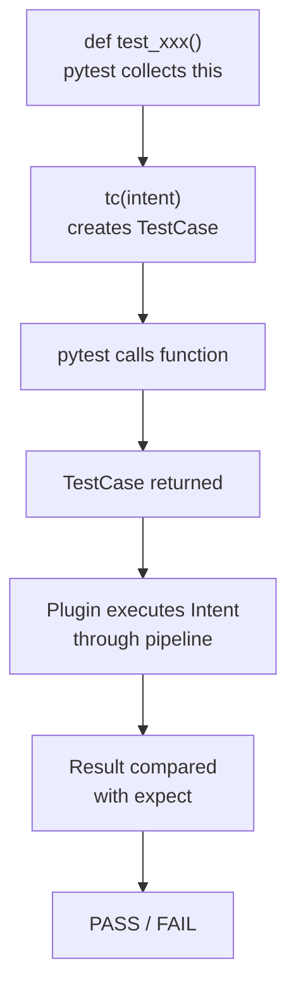

# Testing

IOP-native testing system. Tests are functions that return Intent test cases. pytest collects and runs them.

## Quick Start

```python
# tests/test_api.py
from evoid.testing import tc
from myapp import GET_USER

def test_get_user():
    return tc(GET_USER, expect={"id": 1})
```

```bash
pytest tests/ -v
```

## How It Works



## TestCase

A test case is a frozen dataclass:

```python
@dataclass(frozen=True)
class TestCase:
    name: str                    # Test name
    intent: Intent               # The Intent to test
    expect: Any = None           # Expected result value
    expect_error: type | None    # Expected exception type
    tags: tuple[str, ...] = ()   # Tags for filtering
```

## tc() Helper

Create test cases with `tc()`:

```python
from evoid.testing import tc

# Basic test
case = tc(GET_USER, expect={"id": 1})

# Test with expected error
case = tc(GET_USER, expect_error=ValueError)

# Test with custom name and tags
case = tc(GET_USER, name="user fetch", tags=("fast", "unit"))

# Test with no expectations (just check it runs)
case = tc(GET_USER)
```

## Writing Tests

### @route Style

```python
from evoid.testing import tc
from evoid.adapters.asgi import get
from evoid.web.route import Service

app = Service("test-api")

@get("/users/{user_id}")
async def get_user(user_id: int) -> dict:
    return {"id": user_id, "name": f"User {user_id}"}

# The test
def test_get_user():
    from evoid.core import all_intents
    intent = all_intents()["GET:/users/{user_id}"]
    return tc(intent, expect={"id": 1, "name": "User 1"})
```

### Native IOP Style

```python
from evoid.testing import tc
from evoid.native import create_service, on
from evoid import Intent, Level

app = create_service("test-api")

GET_USER = Intent(name="get_user", level=Level.STANDARD)

async def handle(intent: Intent) -> dict:
    return {"id": 1, "name": "Alice"}

on(app, GET_USER, handle)

# The test
def test_get_user():
    return tc(GET_USER, expect={"id": 1, "name": "Alice"})
```

### Testing Errors

```python
from evoid.testing import tc
from evoid import Intent, Level

ERROR_INTENT = Intent(name="fail", level=Level.STANDARD)

def test_error_handling():
    return tc(ERROR_INTENT, expect_error=ValueError)
```

## pytest Integration

The testing system is a pytest plugin. No extra setup needed.

### Run Tests

```bash
pytest tests/ -v                    # Normal
pytest tests/ -k "user"            # Filter by name
pytest tests/ --evoid-webui         # With WebUI
pytest tests/ -x                    # Stop on first failure
```

### Custom Markers

```python
import pytest

@pytest.mark.slow
def test_heavy_computation():
    return tc(HEAVY_INTENT)

# Run: pytest -m "not slow"
```

## WebUI Dashboard

Docker-style test dashboard:

```bash
pytest tests/ --evoid-webui
# Opens at http://localhost:8001
```

Features:
- Total / Passed / Failed / Duration stats
- Progress bar
- Per-test results with timing
- Dark theme

## Native IOP Testing Pattern

In native IOP, testing follows the same pattern as production:

```python
from evoid.testing import tc
from evoid.native import create_service, on
from evoid import Intent, Level

app = create_service("api")

# Define Intent
GET_USER = Intent(
    name="get_user",
    level=Level.STANDARD,
    metadata={"user_id": 0},
)

# Define handler
async def handle(intent: Intent) -> dict:
    user_id = intent.metadata.get("user_id")
    return {"id": user_id, "name": "Alice"}

# Register
on(app, GET_USER, handle)

# Test
def test_get_user():
    return tc(GET_USER, expect={"id": 1, "name": "Alice"})

def test_get_user_by_id():
    intent = Intent(
        name="get_user",
        level=Level.STANDARD,
        metadata={"user_id": 42},
    )
    return tc(intent, expect={"id": 42, "name": "Alice"})
```

## Best Practices

- **One assertion per test** — Each `tc()` tests one behavior
- **Use meaningful names** — Test names should describe what's being tested
- **Test both success and failure** — Use `expect_error` for error cases
- **Keep tests independent** — No shared state between tests
- **Use tags for filtering** — `tags=("fast", "unit")` for selective runs

## Related

- [Pipeline](pipeline.md) — How execution works
- [Processors](processors.md) — Processor functions
- [Configuration](configuration.md) — Configure engines
