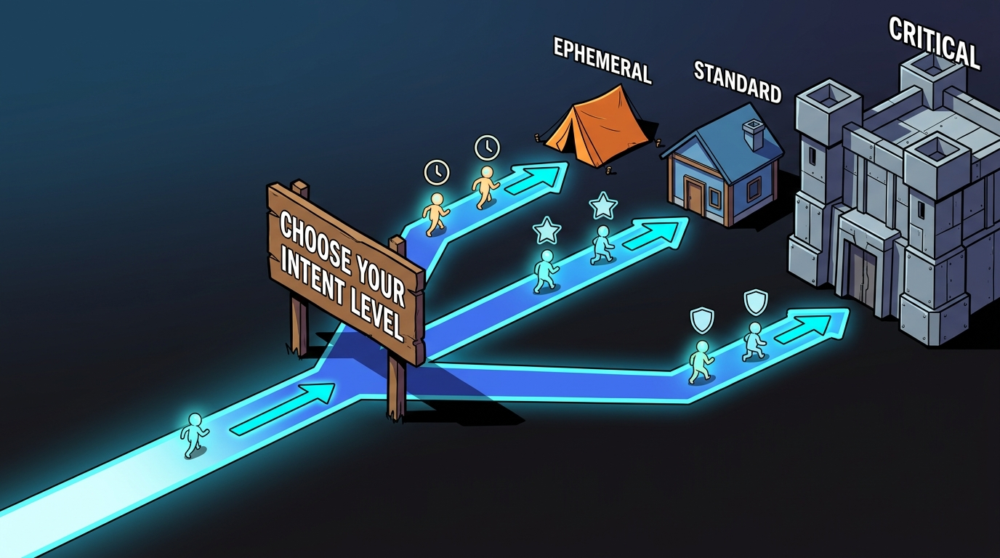

# Why Intent-Oriented Programming?

Details about why IOP exists and how it makes your life as a developer easier.


## In a hurry?

**TL;DR:**

EVOID automatically handles infrastructure based on what your data **means**. You just declare intent, and the framework does the rest.

```python
from evoid.web.route import Service, get

app = Service("my-api")

@get("/users/{user_id}")
async def get_user(user_id: int) -> dict:
    return {"id": user_id, "name": f"User {user_id}"}
```

Behind the scenes, EVOID automatically:
- ✅ Creates an Intent for this endpoint
- ✅ Sets up the pipeline
- ✅ Handles routing
- ✅ Manages error handling
- ✅ Applies caching based on intent level

**You just focus on the business logic.** 🎯

---

## The Story of Building a House 🏠

Imagine you're building a house. 🏠

You have a great architect 📐 who draws beautiful plans. But every time the architect draws a plan, they also have to:

1. Dig the foundation 🔨
2. Lay the bricks 🧱
3. Install the plumbing 🔧
4. Wire the electricity ⚡
5. Paint the walls 🎨
6. Install the roof 🏗️
7. AND THEN build the room the client actually wanted 🛋️

**That's crazy, right?** The architect should just design rooms! 📐

The builder should handle the construction! 🔨

The electrician should handle the wiring! ⚡

---

## Old Code vs IOP 🔄


### The Traditional Way 😰

In the old way, every time you want to build a room (endpoint), YOU have to do everything:

```python
@app.post("/payments")
async def create_payment(data: PaymentData):
    # 1. Dig foundation (validate input)
    validated = validate(data)
    
    # 2. Lay bricks (check authentication)
    user = await get_current_user()
    if not user:
        raise HTTPException(401)
    
    # 3. Install plumbing (check rate limit)
    if await is_rate_limited(user.id):
        raise HTTPException(429)
    
    # 4. Wire electricity (log the request)
    logger.info(f"Payment from {user.id}: {data.amount}")
    
    # 5. Paint walls (connect to database)
    db = await get_database()
    
    # 6. Install roof (check if encrypted)
    if data.is_sensitive:
        data = encrypt(data)
    
    # 7. Build the room (store in database)
    result = await db.insert("payments", data)
    
    return {"status": "success", "payment_id": result.id}
```

**You're doing 7 things just to build ONE room!** 😱

### The IOP Solution 🎯

What if you could just say: **"I want a bedroom"** 🛏️

And the system automatically:
- Digs the foundation 🔨
- Lays the bricks 🧱
- Installs the plumbing 🔧
- Wires the electricity ⚡
- Paints the walls 🎨
- Installs the roof 🏗️
- Builds the bedroom 🛏️

**That's IOP. You declare WHAT you want. The system handles HOW.** 🎯

### The Smart House 🏠✨

With IOP, it's like having a smart house:

- You say "I want a kitchen" 🍳
- The house automatically:
  - Installs the right appliances 🔌
  - Sets up the water pipes 💧
  - Wires the lights 💡
  - Installs the ventilation 🌬️

**You just design the layout (business logic). The house handles the rest.** 🏠

---

## Side by Side 📊

### Traditional (7 lines of infrastructure)
```
validate → auth → rate_limit → log → db_connect → encrypt → store
─────────────────────────────────────────────────────────────────
Total: 7 lines infrastructure + 1 line business
```

### IOP (1 line of intent)
```
@post("/payments")  →  Intent created automatically!
─────────────────────────────────────────────────────────────────
Total: 0 lines infrastructure + 1 line business
```

**That's 7x less code!** 🚀

---

## The Three Intent Levels 📊



### 🗑️ EPHEMERAL — "Temporary room"

```python
session_token: ephemeral(str)
```

Like a **tent** ⛺:
- ⚡ Quick to set up (aggressive caching)
- ⏰ Temporary (5 minute TTL)
- 💾 No foundation (memory only)
- 📉 Low priority

**Use for:** Session data, temporary tokens

### 📊 STANDARD — "Normal room"

```python
name: standard(str)
```

Like a **standard room** 🛏️:
- ⚖️ Balanced setup (normal caching)
- ⏰ Lasts a while (1 hour TTL)
- 💾 Has foundation (persistent storage)
- 📊 Normal priority

**Use for:** User profiles, orders

### 🔒 CRITICAL — "Fortress"

```python
financial_record: critical(dict)
```

Like a **fortress** 🏰:
- 🔐 Armed security (encryption)
- 🔄 Reinforced walls (strong consistency)
- 📝 Security cameras (audit logging)
- 🛡️ Backup generator (emergency buffer)
- 📈 Top priority

**Use for:** Financial data, auth tokens, PII

---

## How It Works ⚙️

When you write:

```python
@get("/users/{user_id}")
async def get_user(user_id: int) -> dict:
    return {"id": user_id}
```

Behind the scenes:

```
1. @get("/users/{user_id}")
        ↓
2. Intent created: Intent("GET:/users/{user_id}", STANDARD)
        ↓
3. Pipeline configured: ["validate", "authorize"]
        ↓
4. Handler registered: get_user function
        ↓
5. Ready to serve! 🚀
```

**One decorator. Four automatic steps. Zero infrastructure code.** ✨

---

## The Paradigm Shift 🔄

### Before (Imperative) 📝

```python
# You tell the system HOW to do everything
def save_user(user):
    encrypted = encrypt(user.email)           # Manual
    cache.set(f"user:{user.id}", encrypted)   # Manual
    db.insert("users", encrypted)             # Manual
    audit_log("user_created", user)           # Manual
```

### After (Declarative) 🎯

```python
# You tell the system WHAT the data means
class User(BaseModel):
    name: standard(str)      # → Normal processing
    email: critical(str)     # → Auto-encrypt, audit, replicate
    session: ephemeral(str)  # → Memory only, auto-expire
```

**The framework handles infrastructure automatically. You focus on what matters.** 🎯

---

## Conclusion ✨

IOP is not just a syntax change. It's a paradigm shift.

- 🎯 **Declarative:** You declare what, framework decides how
- 🧩 **Composable:** Processors are independent LEGO blocks
- ⚡ **Fast:** Async-native, parallel execution built-in
- 🔒 **Secure:** Intent-based security, automatic encryption
- 📈 **Scalable:** From single file to enterprise microservices

**Intent is the platform. The language is an implementation detail.** 🚀

---

## What's Next?

Now that you understand why IOP exists, let's see [how decorators create Intents](intents-behind-the-scenes.md) behind the scenes.
